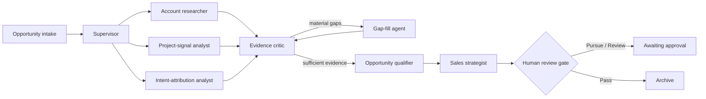

# BuildSignal GTM

BuildSignal turns scattered building-material inquiries into evidence-backed sales opportunities. A LangGraph supervisor dispatches three specialist agents in parallel, an evidence critic checks completeness, deterministic qualification makes the score auditable, and a strategist prepares the sales handoff. No external action happens without human approval.

This is a presentation-ready vertical extension of Omate Labs' MIT-licensed `speed-to-lead-agent` scaffold.

## Why it matters

Building-material revenue teams receive signals through website forms, bid invitations, project notes, architects, contractors, and distributors. The information is often incomplete and the highest-value inquiry is not always the newest one. BuildSignal gives a rep one consistent workflow to:

- research the account, project, and buying intent in parallel;
- distinguish a real project from an early or low-quality inquiry;
- expose the evidence, missing data, and exact score calculation;
- draft a project-aware response and discovery questions;
- hold every outbound action behind a review gate.

## Architecture



The LLM performs synthesis and writing. Qualification remains deterministic, so the same input receives the same score and the rep can explain every point. See [the architecture guide](docs/buildsignal-architecture.md) for the state model, graph flow, and extension points.

## Quickstart

Requires Python 3.12 and [uv](https://docs.astral.sh/uv/).

```bash
git clone https://github.com/tb91117/GTM-agent.git
cd GTM-agent
uv sync --extra dev --extra openai --python 3.12
copy .env.example .env
uv run speed-to-lead opportunity-demo
uv run speed-to-lead serve
```

Open <http://127.0.0.1:8000> for the visual demo or <http://127.0.0.1:8000/docs> for the API explorer.

### Keyless mode

Keep `DEMO_MODE=true`. Specialist results and the draft are deterministic, so the complete graph runs without a network call or API key. This is the safest presentation fallback.

### Live OpenAI mode

Add the following to `.env` and restart the server:

```dotenv
DEMO_MODE=false
OPENAI_API_KEY=your_key_here
OPENAI_MODEL=gpt-5-mini
```

The three specialists and sales strategist then use the OpenAI Responses API. The key stays local: `.env` is ignored by Git. The score and review gate remain deterministic.

## Demo API

```bash
curl -X POST http://127.0.0.1:8000/opportunities/sync \
  -H "content-type: application/json" \
  -d '{
    "email": "maya@northstarfacades.com",
    "contact_name": "Maya Ortiz",
    "company": "Northstar Facades",
    "message": "We need pricing and technical support for an upcoming facade bid.",
    "source": "project-referral",
    "product_category": "architectural panels",
    "project_name": "Riverfront Medical Center",
    "project_location": "Richmond, VA",
    "project_stage": "preconstruction",
    "estimated_value": 480000,
    "deadline": "2026-09-18",
    "decision_maker_role": "Preconstruction Director"
  }'
```

The response includes specialist findings, evidence confidence, missing information, a Pursue/Review/Pass decision, a sales brief, the human-review status, and the complete agent trace.

## Repository map

```text
src/speed_to_lead/
├── agents/opportunity_graph.py          supervisor/worker LangGraph
├── services/opportunity_intelligence.py deterministic and OpenAI specialists
├── api/demo_ui.py                       self-contained presentation UI
├── api/main.py                          FastAPI routes and app lifecycle
├── models.py                            typed graph contracts
└── cli.py                               keyless/live command-line demos
data/sample_opportunities.json           strong and incomplete demo scenarios
tests/test_opportunity_pipeline.py        graph behavior and auditability
docs/buildsignal-architecture.md          technical walkthrough
docs/presentation-guide.md                pitch, demo script, and interview Q&A
```

The original lead intake, classifier, CRM adapters, analytics, MCP server, deployment manifests, and observability examples remain available as the broader production scaffold.

## Validation

```bash
uv run pytest -q
uv run ruff check .
uv run ruff format --check .
uv run mypy
```

## Honest scope

The current demo analyzes supplied opportunity evidence; it does not yet crawl bid portals, enrich private company records, or send email. Those are deliberate integration boundaries. A production pilot would connect approved data sources, persist graph state, add tenant-level access controls, and measure rep acceptance and response-time lift.

