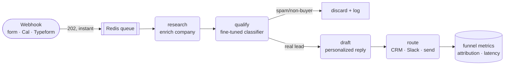

<div align="center">

# ⚡ speed-to-lead-agent

**Qualify and respond to every inbound lead in seconds — with an AI agent you self-host.**

A multi-agent pipeline (LangGraph) that takes a raw inbound lead, scores its fit, drafts a
personalized reply, and routes it to your CRM/Slack. Bring your own keys; runs locally with none.

[](https://github.com/Omate-AI/speed-to-lead-agent/actions/workflows/ci.yml)
[](https://www.python.org)
[](LICENSE)
[](https://github.com/astral-sh/ruff)
[](https://mypy-lang.org)

</div>

---

## Why this exists

Speed is the highest-leverage variable in inbound sales. In the canonical study (*"The Short Life of
Online Sales Leads,"* Harvard Business Review, 2011 — Oldroyd, McElheran & Elkington), firms that
attempted to contact a lead **within an hour were ~7× more likely** to have a meaningful conversation
with a decision-maker than those who waited just an hour longer — and **~60× more** than those who
waited 24+ hours. Yet most teams reply in hours or days because a human has to read, qualify, and
write every first response.

This agent collapses that delay to **seconds**: it qualifies the lead, drafts a tailored reply, and
hands your team a ready-to-send message (or auto-sends the high-confidence ones) — so no good lead
goes cold while someone is in a meeting.

> **Self-hosted and open-source.** A free, ownable alternative to per-seat "instant lead response"
> SaaS — your lead data never leaves your infrastructure.

## What it does



- **Instant intake** — the webhook returns `202` immediately and a worker runs the slow part, so
  capture never blocks on an LLM call.
- **Explainable qualification** — every lead gets a tier (`hot/warm/cold/spam`), an ICP-fit score, a
  buyer-intent label, and human-readable `reasons`. A confidence gate decides auto-send vs. human review.
- **Personalized drafts** — intent-aware first-touch replies, provider-agnostic (Gemini/Groq/OpenAI/…
  via `litellm`) with a keyless template fallback.
- **Real GTM integrations** — Twenty / HubSpot CRM, Slack alerts, email — behind your own keys.
- **Funnel analytics** — source attribution, qualification rate, and speed-to-lead p50/p95, exposed as
  JSON and Prometheus.
- **MCP server** — the same capabilities exposed to Claude/Cursor as tools.

## Quickstart (zero keys, 2 minutes)

```bash
git clone https://github.com/Omate-AI/speed-to-lead-agent
cd speed-to-lead-agent
make install      # uv sync
make demo         # runs sample leads through the full pipeline — no signups
```

You'll see each sample lead qualified, scored, and routed, plus a funnel summary. Then run the API:

```bash
make serve        # http://127.0.0.1:8000  (docs at /docs)

curl -s localhost:8000/leads/sync -H 'content-type: application/json' -d '{
  "email": "maria@northwind-logistics.com",
  "name": "Maria Chen",
  "message": "Need pricing for a 40-person team — can we book a demo?",
  "source": "google_ads"
}' | python -m json.tool
```

## Configuration (bring your own keys)

Copy `.env.example` to `.env`. **Every key is optional** — a missing one disables that feature, it
never breaks the app. With none set, you're in `DEMO_MODE` (local stub model + console adapters).

| Variable | Enables | Required? | Get it |
|----------|---------|-----------|--------|
| `LLM_API_KEY` + `LLM_MODEL` | LLM-written replies (else templated) | optional | [Gemini](https://aistudio.google.com) / [Groq](https://console.groq.com) (free) |
| `TWENTY_API_URL` + `TWENTY_API_KEY` | Push leads to Twenty CRM | optional | Twenty → Settings → API |
| `HUBSPOT_API_KEY` | Push leads to HubSpot | optional | HubSpot private app |
| `SLACK_WEBHOOK_URL` | New-lead Slack alerts | optional | [Slack webhooks](https://api.slack.com/messaging/webhooks) |
| `WEBHOOK_SIGNING_SECRET` | Verify inbound webhook signatures | recommended | self-generated |
| `GREENHOUSE_API_KEY` | ATS / recruiting-pipeline mode | optional | Greenhouse Harvest |

## The classifier

Qualification runs behind a single `Qualifier` interface with two implementations:

1. **`RuleQualifier`** — a transparent, deterministic baseline (the keyless default). Strong, auditable,
   zero dependencies.
2. **LoRA-fine-tuned intent classifier** — DistilBERT fine-tuned with PEFT/LoRA (PyTorch), **744K
   trainable params (1.1% of the model)**, served as its own inference path. `make train` produces the
   adapter (~30s on a laptop); when present it loads automatically, otherwise the rule baseline is used.

**Result** — on a hand-written, held-out realistic set (messages unseen in training):

| Strategy | Accuracy | Macro-F1 | $/1k leads |
|----------|----------|----------|-----------|
| Rule baseline (keyword) | 0.500 | 0.500 | $0 |
| **LoRA classifier** | **0.938** | **0.933** | ~$0 (local) |

Nearly **2× the intent accuracy** of keyword rules on phrasing it never saw — for ~$0, locally, in
milliseconds. That's the case for fine-tuning over a per-lead LLM call. Full methodology in
[`docs/benchmarks.md`](docs/benchmarks.md) and [`MODEL_CARD.md`](MODEL_CARD.md).

## Tech

`Python 3.12` · `FastAPI` · `LangGraph` multi-agent · `pydantic` · `litellm` · `Hugging Face` + `PEFT/LoRA`
· `FAISS` · `Redis` · `MCP` · `Docker` / `Helm` · `GitHub Actions` · `Langfuse` + `Prometheus/Grafana`.

## Project layout

```
src/speed_to_lead/
├── api/           FastAPI app, webhook security
├── agents/        LangGraph pipeline (research → qualify → draft → route)
├── services/      qualify · enrich · draft  (swappable behind protocols)
├── integrations/  CRM (Twenty/HubSpot) · Slack · email
├── analytics/     attribution + speed-to-lead funnel metrics
├── ml/            LoRA fine-tune + eval (the classifier)
├── worker/        async queue (in-memory → Redis)
└── mcp_server/    Model Context Protocol server
```

## Roadmap

- [x] Multi-agent pipeline + keyless demo + funnel analytics
- [x] LoRA-fine-tuned classifier + eval scorecard
- [x] MCP server
- [ ] Langfuse tracing + Grafana dashboards
- [ ] Docker Compose / Helm + GitHub Actions deploy
- [ ] ATS (Greenhouse) connector for recruiting pipelines

## License

MIT © 2026 Omate Labs
