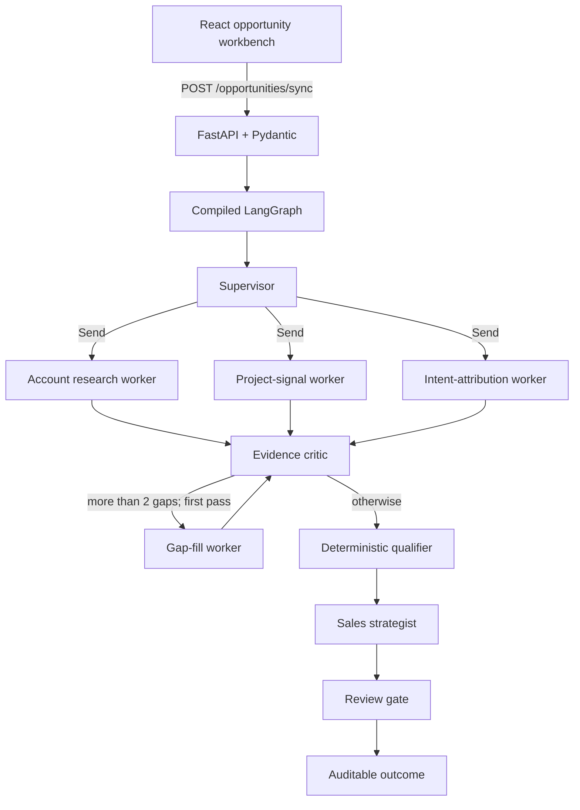

# Monarch interview pack: BuildSignal GTM

Last reviewed: September 4, 2026

This document is a complete study guide, code-review map, demo runbook, and mock-interview
knowledge base for BuildSignal GTM. It is deliberately candid about what the repository does,
what it does not do, what came from the upstream scaffold, and how the design could become a
useful GTM intelligence layer for Monarch Technology.

Do not memorize every sentence. Learn the system's boundaries, follow one request through the
code, understand the scoring arithmetic, and practice explaining the tradeoffs in your own words.

## Contents

1. [The interview in 60 seconds](#1-the-interview-in-60-seconds)
2. [Monarch context and project fit](#2-monarch-context-and-project-fit)
3. [Project provenance and an honest ownership story](#3-project-provenance-and-an-honest-ownership-story)
4. [Product definition](#4-product-definition)
5. [Architecture at a glance](#5-architecture-at-a-glance)
6. [End-to-end execution](#6-end-to-end-execution)
7. [LangGraph deep dive](#7-langgraph-deep-dive)
8. [Scoring and decision policy](#8-scoring-and-decision-policy)
9. [Deterministic and live OpenAI modes](#9-deterministic-and-live-openai-modes)
10. [Backend, API, and runtime](#10-backend-api-and-runtime)
11. [Frontend walkthrough](#11-frontend-walkthrough)
12. [The inherited lead pipeline](#12-the-inherited-lead-pipeline)
13. [Repository map and code-review routes](#13-repository-map-and-code-review-routes)
14. [Testing and verified status](#14-testing-and-verified-status)
15. [Live-demo runbook](#15-live-demo-runbook)
16. [Production gaps and technical debt](#16-production-gaps-and-technical-debt)
17. [How to evolve this for Monarch](#17-how-to-evolve-this-for-monarch)
18. [Evaluation and business metrics](#18-evaluation-and-business-metrics)
19. [Interview question bank with answers](#19-interview-question-bank-with-answers)
20. [Rapid-fire flashcards](#20-rapid-fire-flashcards)
21. [Mock-interviewer prompt](#21-mock-interviewer-prompt)
22. [Study plans](#22-study-plans)
23. [Final cheat sheet](#23-final-cheat-sheet)
24. [Sources](#24-sources)

## 1. The interview in 60 seconds

### One-sentence pitch

BuildSignal is a human-governed, multi-agent opportunity-intelligence workflow that turns an
incomplete inbound signal into evidence, an explainable qualification decision, and a sales
response ready for review.

### Thirty-second version

Revenue teams receive incomplete signals from forms, referrals, campaigns, and project notes.
BuildSignal uses LangGraph to fan one opportunity out to three specialists: account fit, project
signal, and buyer intent. Their results are merged, checked for missing evidence, scored by a
deterministic policy, and converted into a sales brief. The LLM can synthesize evidence and draft
language, but it does not secretly assign the commercial score, and nothing is sent without a
person approving it.

### Ninety-second version

I used a building-material opportunity as a concrete vertical example because it has fragmented
signals, multiple stakeholders, deadlines, and expensive mistakes. A FastAPI endpoint validates
the input. A LangGraph supervisor creates three specialist assignments with `Send`, so the same
worker can run each assignment concurrently. Additive reducers merge findings and trace entries
without last-writer-wins data loss. An evidence critic identifies four material fields and permits
one bounded gap-analysis pass. A deterministic 0-100 policy then produces Pursue, Review, or Pass.
Finally, a strategist drafts a brief and response, and a review gate records either
`awaiting_human_approval` or `archived`.

The system has a deterministic keyless mode for reliable demos and a live mode that uses the
OpenAI Responses API for specialist summaries and the response body. The important design choice
is the separation of probabilistic language work from deterministic policy and human authority.
For Monarch, I would keep that architecture but replace the building-material specialists with
paid-media, SEO/AEO, lifecycle, and revenue-attribution intelligence connected to approved client
data.

### Three claims to repeat

- The model synthesizes and writes; deterministic code makes the demo's commercial decision.
- Parallel specialists are useful only because their evidence criteria are separable and auditable.
- The current system proposes an action; a human remains accountable for taking it.

### Three things never to claim

- Do not say the opportunity graph performs live web research. It assesses submitted evidence.
- Do not say the review gate is a durable LangGraph interrupt. It currently records a status only.
- Do not say this contains Monarch data, production CRM integration, or autonomous email sending.

## 2. Monarch context and project fit

### What Monarch publicly says it does

Monarch Technology's website describes the company as building the operating layer behind modern
growth. Its public channel list includes paid media, SEO, and email; its broader statement also
mentions analytics, lifecycle, and creative systems. The stated focus is revenue quality, and its
delivery model is embedded operators.

The site identifies these leadership perspectives:

| Person | Public role | Likely lens for this conversation |
|---|---|---|
| Joe Yared | CEO and Founder | Commercial value, differentiation, speed to revenue, client usefulness |
| Kyle Griffin | Chief Technology Officer | Architecture, reliability, data boundaries, implementation quality |
| George McCorkell | Executive Director, Go-To-Market | Workflow adoption, channel operations, attribution, measurable outcomes |

These are hypotheses about interview priorities, not claims about their private plans.

### Important correction to the project's positioning

Monarch is not presented on its current website as a building-materials company. BuildSignal's
building-material scenario is therefore a vertical proof, not a literal model of Monarch's own
business. Lead with the reusable workflow:

```text
fragmented signal
    -> parallel evidence assessment
    -> data-quality criticism
    -> explainable prioritization
    -> recommended action
    -> human approval
    -> measured outcome
```

The building-material example demonstrates that workflow under concrete constraints. The Monarch
conversation should focus on how the same operating pattern can coordinate paid, SEO/AEO,
lifecycle, analytics, and creative signals.

### Why this can still attract Monarch

- It is a GTM operating workflow rather than an open-ended chatbot.
- It treats revenue quality as a decision problem, not merely lead volume.
- It separates channel-specific evidence from a common decision contract.
- It exposes reasoning, missing data, and the proposed action to an operator.
- It can run safely in shadow mode before it is allowed to write to client systems.
- Its service interfaces make data providers and model providers replaceable.

### The strongest Monarch-specific framing

> BuildSignal is my vertical test case for a broader GTM intelligence layer. The value is not the
> facade-panel example itself. The value is an auditable orchestration pattern that converts
> channel evidence into a prioritized operator action while keeping revenue policy deterministic
> and the human in control.

### How to speak to each stakeholder

For a CEO, emphasize reduced time from signal to action, operator leverage, repeatable delivery,
and revenue-quality metrics. For a CTO, emphasize typed boundaries, fan-out/fan-in, deterministic
policy, failure modes, privacy, observability, and migration from demo infrastructure. For a GTM
leader, emphasize signal definitions, workflow fit, evidence quality, rep acceptance, attribution,
and experiments against the current process.

## 3. Project provenance and an honest ownership story

### Repository facts

- The repository is a vertical extension of the MIT-licensed Omate Labs
  `speed-to-lead-agent` scaffold.
- The upstream remote and original history are preserved.
- The internal Python package is still named `speed_to_lead`; the product, CLI, API titles,
  frontend, and repository are branded BuildSignal.
- BuildSignal-specific additions include the opportunity models, opportunity graph, deterministic
  and OpenAI intelligence services, opportunity endpoint, samples, tests, technical documentation,
  React interface, and CI coverage for that interface.

### A defensible answer to "Did you build all of this?"

Use only a version that is true for you:

> I did not start from an empty repository. I deliberately used an MIT-licensed lead-processing
> scaffold and preserved its attribution and history. I directed and studied the adaptation into
> the BuildSignal vertical: a separate multi-agent opportunity graph, explicit contracts,
> explainable scoring, a human-review state, a live OpenAI path, tests, and a presentation UI. I
> can walk through the new path end to end and distinguish it from the inherited generic lead
> pipeline. I would not claim authorship of upstream code I did not write.

Do not imply personal authorship of work you did not personally perform. If AI assistance was
part of the implementation, a strong answer is to explain how you specified requirements,
reviewed architecture, ran validation, found weaknesses, and made decisions. Understanding and
accountability matter more than pretending every character was typed manually.

### Why reuse was reasonable

Reusing a licensed scaffold is normal engineering when the reusable parts are not the product
differentiator. The value of this adaptation is in the domain contract, orchestration, policy
boundary, demo experience, and production plan. The correct engineering question is not "Was
every line new?" but "Were provenance, constraints, design choices, and validation handled
honestly?"

## 4. Product definition

### User and job to be done

Primary user: a sales or revenue operator triaging inbound opportunities.

Job to be done:

> When an incomplete commercial signal arrives, help me decide how quickly and seriously to
> pursue it, show me the evidence and missing information, and prepare a relevant response without
> taking an irreversible action for me.

### Inputs

The `OpportunityRequest` contract accepts:

- contact email and optional contact name;
- company and free-text message;
- acquisition source;
- product category;
- project name, location, and stage;
- estimated value and deadline;
- decision-maker role.

Pydantic validates the email, required fields, nonnegative value, and length bounds. The current
deadline is a bounded string rather than a typed date.

### Outputs

The `OpportunityOutcome` returns:

- a generated opportunity ID;
- the validated request;
- each specialist finding, its evidence, and heuristic confidence;
- the score, tier, reasons, and missing information;
- an executive summary, recommended angle, discovery questions, and response draft;
- a routing status;
- an agent trace and elapsed time.

The verbose response is intentional: it doubles as the UI payload and a lightweight audit record.

### Product principles

1. Evidence before action.
2. Missing information becomes a question, not an invented fact.
3. Probabilistic synthesis does not own deterministic commercial policy.
4. A demo must work without network access.
5. External actions require explicit human authority.
6. Every material decision should become measurable.

## 5. Architecture at a glance



### Technology stack

| Layer | Technology | Why it is present |
|---|---|---|
| Contracts | Pydantic 2 | Validation and serialized API models |
| Workflow | LangGraph | Typed state, branches, loop, and parallel worker dispatch |
| API | FastAPI | Async HTTP boundary and generated OpenAPI docs |
| Live model | OpenAI Python SDK and Responses API | Evidence synthesis and response drafting |
| Keyless mode | Deterministic Python service | Reliable tests, offline demo, explainable fallback |
| Frontend | React 19, TypeScript, Vite | Interactive demonstration workspace |
| Styling | Tailwind CSS and shadcn-style local components | Consistent, locally owned presentation components |
| Quality | pytest, Ruff, strict mypy, ESLint, TypeScript | Behavioral, static, and style checks |
| Packaging | `uv`, Hatchling | Reproducible Python environment and CLI packaging |

### Boundary that matters most

The `OpportunityIntelligence` protocol separates orchestration from intelligence. The graph calls
`research`, `fill_gaps`, `qualify`, and `create_brief` without knowing whether the implementation
is deterministic, OpenAI-backed, or a future provider. This is dependency inversion in practical
form: high-level workflow policy depends on an interface, not a vendor SDK.

## 6. End-to-end execution

### Step 1: browser health check

On mount, `frontend/src/App.tsx` requests `GET /health`. The returned `demo_mode` flag controls the
"Safe demo" versus "OpenAI live" label. Failure leaves the UI usable but shows a connecting state.

### Step 2: form normalization

The browser holds every field as a string. Before submission it converts blank optional fields to
`null`, defaults a missing source to `website`, and converts `estimated_value` to a number. It then
posts JSON to `/opportunities/sync`.

### Step 3: HTTP validation

FastAPI parses the body into `OpportunityRequest`. Invalid emails, missing company/message,
negative values, or overlong fields return validation errors before the graph runs.

### Step 4: graph invocation

`OpportunityPipeline.run` starts a monotonic timer and invokes the compiled graph with the request,
empty findings, empty trace, and `critic_passes=0`.

### Step 5: supervisor and fan-out

The supervisor writes a trace event. `_dispatch_research` creates three fixed `ResearchTask`
objects and returns three `Send("research_worker", ...)` values. The worker node is reused with a
different role and objective for each branch.

### Step 6: specialist work

Each worker calls the injected intelligence service:

- `account_research` assesses named company, buyer role, and commercial fit;
- `project_signal` assesses scope, location, stage, product, value, and deadline;
- `intent_attribution` assesses language, source, urgency, and response priority.

In deterministic mode, these are bounded heuristics over submitted fields. In live mode, the
baseline evidence is passed to OpenAI for an evidence-constrained summary.

### Step 7: fan-in through reducers

All worker branches write a one-item `findings` list and a one-item `agent_trace` list. Those state
keys are annotated with `operator.add`, so LangGraph concatenates updates. Without reducers,
parallel writes to the same state key could overwrite each other or raise an invalid update.

Parallel update order is not a contractual ordering. The UI should identify findings by agent
name, not assume the first finding always belongs to a particular role.

### Step 8: evidence criticism

The critic checks four fields:

1. project name;
2. product category;
3. estimated opportunity value;
4. decision or bid deadline.

If more than two are missing on the first critic pass, the graph routes to `gap_fill`. Gap fill does
not discover or fabricate values; it converts the gaps into explicit questions. The graph returns
to the critic. On the second pass, the bounded `critic_passes < 2` condition prevents another loop
and sends the opportunity to qualification.

### Step 9: deterministic qualification

`qualify` computes the score and maps it to Pursue, Review, or Pass. Live OpenAI mode inherits the
same method, so model wording cannot change the score.

### Step 10: strategy

The strategist creates a summary, sales angle, discovery questions, subject, and body. In live
mode, only the response body is replaced by model output; the deterministic baseline supplies the
rest and provides a fallback if model output is blank.

### Step 11: review gate

Pursue and Review become `awaiting_human_approval`. Pass becomes `archived`. No email or CRM write
occurs in the opportunity graph.

### Step 12: response and rendering

`run` creates an `opp_` ID, calculates latency, validates the final `OpportunityOutcome`, and
returns it through FastAPI. The browser renders Overview, Evidence, Agent trace, and Response tabs.

## 7. LangGraph deep dive

### Shared state

`OpportunityState` is a `TypedDict` with optional keys because different nodes populate different
parts over time.

| State key | Writer | Update behavior |
|---|---|---|
| `request` | invocation | Stable input |
| `task` | each `Send` branch | Worker-local assignment |
| `findings` | research workers and gap fill | Additive reducer |
| `gaps` | evidence critic | Overwrite |
| `critic_passes` | evidence critic | Overwrite with incremented value |
| `decision` | qualifier | Single owner |
| `brief` | strategist | Single owner |
| `routing_status` | review gate | Single owner |
| `agent_trace` | most nodes | Additive reducer |

Pydantic models are used at API and domain boundaries, while `TypedDict` is used for lightweight
internal graph state. The final state is converted back to a Pydantic model.

### Why `Send` instead of three separate node implementations?

`Send` expresses an orchestrator-worker/map-reduce pattern. The task count and task payload can be
created dynamically while one worker implementation handles all tasks. Today the role list is
fixed at three, but the pattern supports generating specialists from configuration later.

### Why reducers are necessary

Concurrent branches all update `findings` and `agent_trace`. A reducer defines how simultaneous
updates combine. `operator.add` is appropriate for list concatenation. It is simple and pure, but
it does not guarantee semantic ordering; production traces should include timestamps, run IDs,
node IDs, and explicit sort keys.

### Why a bounded loop?

An unconstrained critic/research loop can spend indefinitely, repeat work, or amplify model errors.
The explicit pass counter makes the current graph terminate after at most one gap-fill step. A
production design would also configure a graph recursion limit, per-node timeouts, retries, and a
cost budget.

### Is the supervisor an LLM agent?

No. The current supervisor is deterministic orchestration. It records a trace, and the conditional
edge dispatches a fixed set of tasks. Calling it a supervisor describes its graph role, not a claim
that an LLM autonomously plans the workflow.

### Is this genuinely multi-agent?

It is a multi-specialist orchestrator-worker graph: separate role contexts execute concurrently,
produce independently inspectable findings, and merge into a shared decision flow. However, all
roles currently share one worker implementation and one intelligence service, have no independent
tools or memory, and receive the same request. If the only goal were one low-volume summary, a
single structured prompt would be simpler and cheaper. The architecture earns its complexity when
specialists gain different data sources, evaluation criteria, permissions, or scaling behavior.

### Current versus full human-in-the-loop

Current behavior:

```text
graph finishes -> routing_status says approval is required
```

A durable implementation should instead:

```text
graph checkpoints state -> interrupt emits review task -> operator edits/approves/rejects
-> graph resumes with identity and audit metadata -> connector performs allowed action
```

The repository has the policy boundary but not the durable interrupt/resume implementation.

## 8. Scoring and decision policy

### Exact arithmetic

Every valid opportunity starts with 20 points for a named company and valid inquiry.

| Signal | Points | Code condition |
|---|---:|---|
| Baseline | 20 | Valid request with company and message |
| Business email domain | 15 | Domain is not in the four-domain free-email set |
| Named project | 15 | `project_name` is truthy |
| Product category | 15 | `product_category` is truthy |
| Estimated commercial value | 15 | `estimated_value is not None` |
| Deadline | 10 | `deadline` is truthy |
| High-intent language | 10 | Message contains quote, pricing, bid, purchase, or need |

Thresholds:

- Pursue: score 70-100;
- Review: score 45-69;
- Pass: score below 45.

### Strong sample calculation

The Northstar/Riverfront sample receives:

```text
20 baseline
+15 business email
+15 named project
+15 product category
+15 estimated value
+10 deadline
+10 high-intent language ("need" and "quote")
=100 -> Pursue -> awaiting_human_approval
```

### Incomplete sample calculation

The Rivera Renovations sample uses Gmail and lacks project, product, value, and deadline. Its
message does not contain a configured high-intent term:

```text
20 baseline
=20 -> Pass -> archived
```

It also triggers gap fill because all four material fields are absent.

### Why deterministic scoring is useful

- The same input gives the same score.
- A rep can reconstruct every point.
- Threshold changes are code/config changes rather than hidden prompt behavior.
- A pilot can compare the rule baseline with learned alternatives.
- The LLM can fail without silently changing qualification policy.

### Why this score is not production-ready

- The weights are hypotheses, not calibrated against won/lost outcomes.
- The free-email set is tiny and can misclassify valid buyers or weak business domains.
- `estimated_value=0` still earns 15 points because the check is `is not None`.
- Deadline is present/absent; it is not parsed for urgency or validity.
- A keyword match can confuse negation, quoted text, or prompt injection with intent.
- Company existence and project truth are not externally verified.
- There is no industry-, client-, segment-, or source-specific calibration.

Call it an explainable baseline policy, not an AI prediction or probability of closing.

### Score versus confidence

The 0-100 decision score is not statistical confidence. Each `AgentFinding` also contains a
separate heuristic confidence based mainly on evidence count; that value is not calibrated either.
The frontend currently labels the score bar "Qualification confidence," which is imprecise. A
production UI should call it "qualification score" and display evidence confidence separately.

## 9. Deterministic and live OpenAI modes

### Deterministic mode

Selection condition: `DEMO_MODE=true`, or no usable OpenAI key.

Properties:

- no model or network dependency;
- stable output for tests and rehearsals;
- same graph topology as live mode;
- heuristic findings, confidence, score, brief, and response;
- safest live-presentation fallback.

This is not a fake graph. It is a deterministic implementation of the intelligence interface.
What is mocked is external research and generative synthesis.

### Live mode

Selection condition: `DEMO_MODE=false` and `OPENAI_API_KEY` is present.

`OpenAIOpportunityIntelligence` creates an `AsyncOpenAI` client. `_respond` calls
`client.responses.create` with:

- `model` from `OPENAI_MODEL`;
- `instructions` containing the specialist or strategist constraint;
- `input` containing JSON-serialized request and evidence;
- `max_output_tokens=1000`.

The service reads `response.output_text`, trims it, and falls back to deterministic text when the
result is blank. The official OpenAI API reference describes `instructions` as a system/developer
message, `input` as text/image/file input, `max_output_tokens` as an upper bound, and recommends
the SDK's `output_text` helper instead of assuming the first raw output item is a message.

### Exactly what OpenAI controls

- The three specialist summary strings.
- The final email body.

### Exactly what OpenAI does not control

- Input validation.
- Which three roles run.
- Which fields count as gaps.
- Whether gap fill runs again.
- Score weights and decision thresholds.
- The final review status.
- Any external action, because the opportunity path has none.

### Prompt guardrails

The specialist instruction says to use only supplied fields and baseline evidence and not invent
facts. The strategist instruction limits the response to 130 words, asks for a technical review,
and prohibits unsupported product claims. The payload includes structured request, decision, and
finding data.

These are useful constraints, not a complete security boundary. Production still needs untrusted
input isolation, structured output validation, content policy, redaction, provider data settings,
and adversarial evaluation.

### Live-mode gaps to mention proactively

- No application-level timeout, retry policy, rate-limit handling, or circuit breaker.
- No structured output schema for specialist summaries or the email body.
- No token, latency, or per-opportunity cost accounting on this path.
- No `store` parameter is set. The current OpenAI API reference says Responses are stored by
  default when omitted, subject to retention rules. A production privacy review should choose the
  correct setting and contract explicitly.
- No model-output safety classifier or automated factual citation check.
- No concurrency cap or client-level backpressure for a burst of opportunities.

## 10. Backend, API, and runtime

### FastAPI lifespan

At startup, `lifespan`:

1. loads cached settings from `.env` and the process environment;
2. configures structured logging;
3. optionally enables Langfuse for the inherited LLM draft path;
4. builds both the inherited lead pipeline and BuildSignal opportunity pipeline;
5. creates an in-memory lead queue;
6. starts one background lead consumer task.

At shutdown it cancels and awaits the worker task.

### API surface

| Method and path | Purpose | Important boundary |
|---|---|---|
| `GET /` | React build or embedded fallback UI | Static presentation layer |
| `GET /health` | Liveness, demo flag, queue size | Not a full dependency-readiness check |
| `POST /opportunities/sync` | Run BuildSignal graph inline | Main demo path; no auth today |
| `POST /leads` | Validate optional HMAC and enqueue generic lead | Returns 202 quickly |
| `POST /leads/sync` | Run inherited lead graph inline | Test/demo endpoint |
| `GET /metrics` | Generic lead funnel metrics | Does not record opportunity outcomes |
| `GET /metrics/prometheus` | Minimal Prometheus exposition | In-process counters only |
| `GET /docs` | Generated OpenAPI explorer | Useful demo fallback |

### Sync versus async nuance

`/opportunities/sync` is an async FastAPI handler, but it waits for the entire graph and returns the
outcome in the same HTTP response. The three specialist branches can execute concurrently within
the graph. It is not a queued, durable background job.

`/leads` is the endpoint that returns 202 and uses the in-memory worker. Do not accidentally claim
that behavior for the opportunity endpoint.

### Webhook security

The generic `/leads` path can verify an HMAC-SHA256 signature with constant-time comparison. If
`WEBHOOK_SIGNING_SECRET` is absent, verification is disabled. The main opportunity endpoint has no
authentication, authorization, rate limiting, tenant isolation, or CSRF-specific design today.

### Configuration behavior

`pydantic-settings` reads `.env`; environment variables override defaults. Credentials are
optional so the app degrades to console or deterministic implementations. `get_settings` is cached,
which means a running process must restart or clear the cache to observe changed configuration.

### Static frontend serving

If `frontend/dist/assets` exists, FastAPI mounts it at `/assets`. `/` returns the built
`index.html`; otherwise it returns a simpler embedded HTML fallback. This gives the demo a graceful
degradation path when Node assets have not been built.

## 11. Frontend walkthrough

### Purpose

The React application is a presentation workbench, not a complete CRM. It is designed to make the
workflow visible: structured intake on the left and decision evidence on the right.

### Main state

`App` owns:

- `form`: controlled opportunity fields;
- `result`: the last `OpportunityOutcome`;
- `health`: API status and mode;
- `loading`: disables submission and shows specialist skeletons;
- `error`: renders request failure feedback.

`ResultView` separately owns the active result tab and temporary copy confirmation.

### Result tabs

- Overview: tier, score, recommended angle, positive reasons, and missing information.
- Evidence: one card per specialist with summary, evidence, and confidence.
- Agent trace: a readable execution timeline.
- Response: subject, draft body, discovery questions, and copy button.

### shadcn-style component approach

The UI components under `frontend/src/components/ui` are local source files. This follows the
shadcn philosophy of owning component code instead of depending on an opaque component package at
runtime. Variants use class-variance-authority; `cn` combines `clsx` and `tailwind-merge`.

### Frontend strengths

- Typed request/result shapes.
- Clear loading, empty, error, and result states.
- Responsive layout with a desktop sidebar and smaller-screen header.
- Explicit demo/live status.
- Evidence and trace are first-class rather than hidden in console logs.
- Production build is served by the same FastAPI service.

### Frontend gaps

- No component, accessibility, or browser end-to-end tests.
- No retry button that resubmits after a transient API error.
- No request cancellation or stale-result protection.
- Navigation items other than Opportunity Lab are placeholders.
- No authenticated user, tenant, approval action, or persistent run history.
- Copy uses the Clipboard API without a user-facing fallback for denied permission.
- The score bar's confidence label is semantically inaccurate.
- Dates and currency are not localized or validated beyond HTML/input and backend bounds.

## 12. The inherited lead pipeline

The repository contains two related but different workflows. Knowing this prevents confusion in a
live code review.

### Generic inherited lead pipeline

```text
normalize -> research/enrich -> qualify -> spam?
    spam -> CRM record -> end
    real -> draft -> CRM/notify route -> end
```

Capabilities include:

- generic inbound lead normalization;
- mock company enrichment;
- rule or optional LoRA intent classification;
- template or LiteLLM reply drafting;
- console, Twenty, and HubSpot CRM adapters;
- console or Slack notification;
- an in-memory async queue;
- source-attributed funnel metrics;
- optional ATS, ML, MCP, Kubernetes, Helm, Prometheus, and Grafana scaffold pieces.

### BuildSignal opportunity pipeline

```text
supervisor -> three specialists -> critic -> optional gap fill
-> deterministic score -> sales strategy -> review status
```

This is the path used by the React presentation interface.

### Why both remain

The inherited pipeline demonstrates broader production scaffolding and integration patterns. The
new opportunity graph demonstrates the domain-specific multi-agent workflow. In a product cleanup,
choose one of two directions:

1. converge them into one canonical opportunity platform with shared queue, identity, metrics,
   connector, and approval abstractions; or
2. separate the generic scaffold and the vertical application into distinct packages/services.

Keeping both indefinitely without a clear boundary would increase conceptual and maintenance cost.

## 13. Repository map and code-review routes

### BuildSignal path

| File | What to know |
|---|---|
| `src/speed_to_lead/models.py` | Pydantic input, finding, decision, brief, and outcome contracts |
| `src/speed_to_lead/agents/opportunity_graph.py` | State, reducers, `Send`, critic loop, qualifier, gate |
| `src/speed_to_lead/services/opportunity_intelligence.py` | Protocol, deterministic service, OpenAI service |
| `src/speed_to_lead/api/main.py` | Lifespan, routes, frontend serving, two pipelines |
| `src/speed_to_lead/config.py` | Mode and provider selection |
| `src/speed_to_lead/cli.py` | Demo, opportunity demo, and server commands |
| `data/sample_opportunities.json` | Strong and incomplete scenarios |
| `tests/test_opportunity_pipeline.py` | Core branch and auditability behavior |
| `tests/test_api.py` | HTTP contract and demo-mode isolation |
| `frontend/src/App.tsx` | Complete presentation workflow |
| `frontend/src/types.ts` | Browser-side response contract |

### Five-minute code-review route

1. Open `OpportunityRequest` and `OpportunityOutcome` in `models.py`.
2. Show `OpportunityState` and its two additive reducers.
3. Show `_dispatch_research` returning three `Send` values.
4. Show `_after_critic` and explain the bounded loop.
5. Show `qualify` in `opportunity_intelligence.py` and calculate the sample score.
6. Show `get_intelligence` to explain keyless versus live mode.
7. Show `/opportunities/sync` and the four behavior tests.

### Fifteen-minute code-review route

Add these to the five-minute route:

1. Trace `App.analyze` through FastAPI and `OpportunityPipeline.run`.
2. Compare deterministic `research` with the live override.
3. Explain why the live class inherits deterministic scoring.
4. Show the review gate and state clearly that it is a status, not an interrupt.
5. Compare the generic `LeadPipeline` and new opportunity graph.
6. End with the production-gap list and Monarch-specific evolution.

### If asked to modify code live

Good small exercises include:

- type `deadline` as a date and add urgency scoring tests;
- reject or avoid rewarding zero estimated value;
- rename the score UI label;
- add boundary tests for scores 44/45 and 69/70;
- add a fake intelligence service that proves worker concurrency;
- add a timeout/retry policy to the live worker;
- add an opportunity metrics recorder;
- make the review gate a real checkpointed interrupt.

Before editing, state the behavioral invariant and add or update a test first.

## 14. Testing and verified status

### Verified on September 4, 2026

- Backend tests: 33 passed, 1 skipped.
- Ruff: all checks passed.
- Strict mypy: no issues in 37 source files.
- Frontend TypeScript/Vite production build: passed; 1,862 modules transformed.
- Frontend ESLint: passed.
- Production frontend bundle at verification: approximately 257 KB JavaScript before gzip,
  approximately 80 KB gzip; approximately 39 KB CSS before gzip, approximately 7 KB gzip.

The test run emitted a non-failing Starlette `TestClient` deprecation warning and a local sandbox
cache warning. Do not describe warnings as test failures.

### What the opportunity tests prove

1. A complete project reaches Pursue and still requires human approval.
2. All three specialist roles contribute findings.
3. An incomplete opportunity triggers gap fill, reaches Pass, and archives.
4. Outcomes contain reasons, evidence, and an audit trace.
5. The API returns the expected sales-brief contract.
6. Tests force demo mode so a developer's local `.env` cannot trigger paid model calls.

### What the tests do not prove

- Actual concurrency or latency improvement.
- Live OpenAI success, error handling, or output quality under mocks.
- Reliability of CRM/notification providers for this opportunity flow.
- Persistence, recovery, idempotency, authentication, or tenant isolation.
- Frontend interaction and accessibility behavior.
- Calibration against real revenue outcomes.
- Resistance to prompt injection or sensitive-data leakage.

### Commands

```powershell
uv run pytest -q
uv run ruff check .
uv run ruff format --check .
uv run mypy

cd frontend
npm.cmd run build
npm.cmd run lint
```

On Windows, `npm.cmd` avoids a PowerShell execution-policy problem that can block `npm.ps1`.

## 15. Live-demo runbook

### Recommended mode

Use deterministic mode for the primary interview demo. It exercises the full graph while removing
Wi-Fi, quota, credential, and output-variance risk. Offer live OpenAI mode as an optional second
pass, not as the only path.

### Preflight the day before

```powershell
cd E:\Work\_BearxAI\GTM-agent
uv sync --extra dev --extra openai --python 3.12

cd frontend
npm.cmd install
npm.cmd run build

cd ..
uv run pytest -q
uv run buildsignal opportunity-demo
```

Ensure `.env` contains:

```dotenv
DEMO_MODE=true
```

Never screen-share the contents of `.env`.

### Start the demo

```powershell
cd E:\Work\_BearxAI\GTM-agent
uv run buildsignal serve
```

Open `http://127.0.0.1:8000`. Keep these backup tabs or commands ready:

- `http://127.0.0.1:8000/docs`
- `http://127.0.0.1:8000/health`
- `uv run buildsignal opportunity-demo`

### Three-minute talk track

#### 0:00-0:25 - frame the problem

> This is an opportunity decision room, not a generic chatbot. It takes a fragmented signal and
> shows an operator the evidence, gaps, score, proposed response, and approval state.

#### 0:25-0:55 - submit the strong sample

Point out the company, project, product, stage, value, deadline, buyer role, and quote language.
Click Analyze.

> LangGraph fans this request out to account, project, and intent specialists. They are separate
> because those evidence criteria can run independently and later connect to different data
> sources.

#### 0:55-1:30 - explain the result

Open Overview. Calculate 20 + 15 + 15 + 15 + 15 + 10 + 10 = 100 aloud.

> The model did not secretly choose 100. The policy is deterministic and every point is visible.

Open Evidence and Agent trace briefly.

> Findings are merged with reducers, then a critic checks material completeness before scoring.

#### 1:30-1:55 - show human governance

Open Response.

> The strategist prepares a draft and discovery questions, but the status is awaiting human
> approval. This demo proposes; it does not send.

#### 1:55-2:35 - show the incomplete case

Reset or clear project name, product category, estimated value, and deadline. Change email to a
free domain and message to `Just exploring options.` Submit again.

> This is where not hallucinating is commercially useful. The critic finds four gaps, gap fill
> produces questions instead of facts, the bounded loop terminates, and the policy returns Pass.

Show the gap-fill event in Agent trace and questions in Response.

#### 2:35-3:00 - connect to Monarch

> For Monarch, these workers become channel and revenue-evidence specialists. A first pilot would
> connect one approved data source, run in shadow mode, and measure operator acceptance and time to
> action before any write-back is enabled.

### Ten-minute expanded demo

After the UI flow:

1. Open `models.py` and show the request/outcome contract.
2. Open `opportunity_graph.py` and show the reducers and `Send` dispatch.
3. Open the critic condition and scoring method.
4. Open `get_intelligence` and explain mode selection.
5. Open the tests and map each test to a business invariant.
6. Close with one limitation and one next step rather than pretending it is production-ready.

### Demo recovery matrix

| Failure | Recovery |
|---|---|
| OpenAI/network error | Set `DEMO_MODE=true`, restart server |
| React build missing | FastAPI serves the embedded fallback UI |
| Browser problem | Run `uv run buildsignal opportunity-demo` |
| Port 8000 occupied | Run `uv run buildsignal serve --port 8001` and open that port |
| Unexpected score | Read the reasons and calculate points aloud |
| API validation error | Use the prefilled sample or inspect `/docs` |
| Interviewer challenges live data | Agree: all evidence is supplied in this prototype |

## 16. Production gaps and technical debt

Treat this section as interview ammunition. Identifying limitations is a sign of ownership.

### Data and domain

- The opportunity graph has no real research connector; specialist evidence is supplied data.
- No source URLs, observation timestamps, freshness rules, or provenance IDs exist.
- Deadline should be a typed date/datetime with timezone and urgency semantics.
- Currency is absent from estimated value.
- There is no deduplication, account identity resolution, or idempotency key.
- The building-material vocabulary is hard-coded in prompts and demo text.

### Workflow

- The supervisor is fixed orchestration, not dynamic planning.
- Gap fill creates questions but cannot seek answers or pause for a user.
- The review gate is not a checkpointed interrupt/resume workflow.
- No checkpointer is passed to `compile`.
- The opportunity ID is generated after execution, making retry deduplication difficult.
- Parallel trace ordering is not guaranteed.
- There is no per-branch fallback if one specialist fails.

### Model layer

- Prompt-only plain-text output rather than a strict schema.
- No retries, timeout policy, rate-limit strategy, caching, or concurrency controls.
- No prompt versioning or model-run metadata in the outcome.
- No citations or claim-level grounding validation.
- Heuristic confidence is not calibrated.
- Provider data retention is not explicitly configured in the call.

### Security and privacy

- `/opportunities/sync` has no auth, tenant boundary, or rate limiting.
- Submitted text may contain PII, confidential project data, or prompt injection.
- No field-level redaction, retention schedule, deletion path, or audit identity.
- The generic webhook allows unsigned calls when no secret is configured.
- External URLs and connector outputs would need SSRF, content-type, size, and trust controls.
- Production secrets need a secret manager, rotation, least privilege, and environment separation.

### Operations

- The lead queue is in memory and loses work on restart.
- The opportunity endpoint is synchronous and can exceed proxy timeouts under slow models.
- Metrics track generic leads, not opportunity runs or model cost.
- Health is liveness-oriented and does not verify dependencies.
- No distributed tracing spans connect browser, API, graph nodes, model calls, and write-back.
- No dead-letter queue, replay tool, or run-state UI.

### Product and UX

- There is no real approve/edit/reject action.
- No owner assignment, SLA, comments, or collaboration.
- No run history or side-by-side comparison.
- No explanation of why absent signals did not receive points beyond the missing list.
- No client-specific policy or threshold management.

### Naming and structure

The internal package remains `speed_to_lead`, and the inherited pipeline coexists with the
BuildSignal path. This is honest technical debt from incremental adaptation. Rename/migrate only
with import compatibility, tests, and a clear package-boundary decision.

## 17. How to evolve this for Monarch

### Target concept: Monarch GTM Intelligence Layer

Replace the building-material request with a normalized `GrowthSignal`:

```text
GrowthSignal
- client_id and workspace_id
- channel: paid | seo | lifecycle | creative | inbound
- source_system and source_record_id
- observed_at and freshness
- entity: campaign | account | lead | keyword | content | segment
- metrics and comparison window
- free-text context
- permissions and provenance
```

### Candidate specialist design

| Specialist | Evidence | Example output |
|---|---|---|
| Paid performance | Spend, CAC, ROAS, conversion, creative fatigue | Budget or creative anomaly |
| SEO/AEO | Rankings, impressions, citations, query coverage, content decay | Content opportunity with evidence |
| Lifecycle | Deliverability, engagement, stage movement, cohort drop-off | Segment or sequence intervention |
| Revenue attribution | CRM stages, source quality, pipeline, lag | Revenue-quality assessment |
| Data-quality critic | Missing joins, stale windows, inconsistent definitions | Block, warn, or request data |

Do not add every specialist on day one. A pilot should select the one decision where evidence,
operator pain, and measurable value are clearest.

### Example Monarch workflow: revenue-quality anomaly

```text
paid spend rises while qualified pipeline falls
    -> paid specialist checks campaign and creative metrics
    -> lifecycle specialist checks lead follow-up and stage movement
    -> attribution specialist checks source-to-opportunity joins
    -> critic rejects conclusions if windows or IDs do not reconcile
    -> deterministic policy assigns severity and SLA
    -> strategist proposes investigation and channel actions
    -> embedded operator approves/edits
    -> system records action and later revenue outcome
```

### Four plausible use cases

1. Inbound lead triage across forms, paid campaigns, and referral sources.
2. Cross-channel anomaly detection tied to qualified pipeline rather than clicks alone.
3. SEO/AEO opportunity discovery with evidence and operator-approved content briefs.
4. Lifecycle leakage detection with proposed segment or sequence interventions.

### 30/60/90-day plan

#### Days 0-30: discovery and shadow baseline

- Pick one client/workflow and one decision owner.
- Define a signal contract and the exact current manual process.
- Connect one read-only approved source and one outcome source.
- Label historical examples with operator decisions and downstream outcomes.
- Run deterministic/rule logic plus model synthesis in shadow mode.
- Measure baseline latency, volume, data completeness, and operator agreement.

#### Days 31-60: operator pilot

- Add a durable store, run IDs, provenance, and authentication.
- Add real review/edit/reject UI and capture reason codes.
- Introduce structured model outputs, retries, budgets, and trace metadata.
- Calibrate decision thresholds using historical and shadow-mode evidence.
- Send approved tasks to a sandbox or non-destructive queue, not production automation.

#### Days 61-90: controlled production

- Enable one reversible write-back behind role-based approval.
- Add client-specific policy configuration and tenant isolation.
- Monitor precision, acceptance, action latency, cost, and downstream revenue quality.
- Run rollback drills and data-quality failure tests.
- Expand channels only after the first workflow beats its baseline.

### Design changes from current demo

| Current | Monarch-ready direction |
|---|---|
| Submitted fields | Permissioned source connectors with provenance |
| Fixed three roles | Configured channel specialists with distinct permissions |
| Plain-text findings | Strict schemas with claim-level source references |
| Heuristic gaps | Contract- and freshness-aware data-quality policy |
| Static 0-100 points | Client-specific, versioned, calibrated decision policy |
| Status-only gate | Checkpointed approve/edit/reject interrupt |
| Inline request | Durable job plus stream/poll status |
| In-memory evidence | Tenant-scoped persistent run record |
| No action | One reversible, audited write-back |

## 18. Evaluation and business metrics

### Evaluation layers

#### 1. Contract evaluation

- Input validation accuracy.
- Required-field and schema compliance.
- Output parse success.
- Provenance coverage.
- Duplicate and idempotency behavior.

#### 2. Specialist evaluation

- Evidence extraction precision and recall.
- Unsupported-claim rate.
- Citation correctness and freshness.
- Gap detection recall.
- Agreement with domain experts.

#### 3. Decision evaluation

- Precision and recall by Pursue/Review/Pass.
- Precision at Pursue, because false positives waste expensive operator time.
- Calibration of score bands against actual outcomes.
- Confusion matrix by source, client, and segment.
- Stability under irrelevant wording changes.

#### 4. Draft evaluation

- Factual consistency with evidence.
- Required-question coverage.
- Tone/brand rubric.
- Edit distance or edit time before approval.
- Unsafe or unsupported claim rate.

#### 5. System evaluation

- End-to-end p50/p95 latency.
- Branch latency and failure rate.
- Cost per analyzed signal and per accepted action.
- Retry, timeout, and recovery behavior.
- Queue age, throughput, and dead-letter volume.

#### 6. Business evaluation

- Operator acceptance rate.
- Time from signal to first approved action.
- Qualified meeting or opportunity conversion.
- Pipeline and revenue quality by source.
- Incremental lift versus the existing process.
- Hours saved without increased false positives.

### Offline evaluation design

Build a time-split dataset of historical signals, the evidence available at decision time, operator
decision, and downstream outcome. Prevent future information from leaking into the input. Compare:

1. current manual/rule baseline;
2. one-prompt baseline;
3. multi-specialist system;
4. multi-specialist system plus critic.

This ablation answers whether multi-agent complexity creates measurable value.

### Online rollout

1. Shadow: recommendations invisible or nonbinding.
2. Advisory: operators see recommendations and choose actions.
3. Assisted: approved actions are prepared automatically.
4. Controlled automation: only low-risk, reversible actions under explicit policy.

Do not begin by auto-sending or changing budgets.

### North-star and guardrail metrics

A reasonable north-star is accepted qualified actions that produce downstream pipeline, not raw
agent runs. Guardrails include unsupported-claim rate, false-positive Pursue rate, latency, cost,
privacy incidents, and operator override rate.

## 19. Interview question bank with answers

### Product and Monarch fit

#### Q1. Why did you choose this project for Monarch?

Monarch describes its work as a GTM operating layer with paid, SEO, email, analytics, lifecycle,
and creative moving together, with revenue quality as the focus. BuildSignal demonstrates the
same structural problem in a concrete vertical: collect uneven signals, assign specialist evidence
work, check quality, prioritize transparently, and prepare an operator action. I would not claim
the building-material domain itself maps to Monarch; I would map the orchestration and governance
pattern to Monarch's channel stack.

#### Q2. What business problem does it solve?

It reduces the delay and inconsistency between receiving a signal and preparing a defensible next
action. It also exposes why an opportunity is prioritized and what information is missing, which
helps the operator act quickly without trusting a black-box score.

#### Q3. Who is the user?

The current user is a sales/revenue operator. For Monarch, the analogous user could be an embedded
GTM operator responsible for reviewing cross-channel recommendations for a client.

#### Q4. Why is this more than a chatbot?

The UI is structured around a business workflow and typed outcome, not a conversation. The graph
has explicit nodes, conditional routing, a bounded loop, deterministic policy, and a review state.
The model has limited responsibilities inside that workflow.

#### Q5. What is the first Monarch pilot you would propose?

I would not propose a broad autonomous growth agent. I would choose one high-frequency decision,
one read-only source, one outcome system, and one operator. Run in shadow mode, establish the
current baseline, then measure evidence accuracy, operator acceptance, and time to action.

### Architecture and LangGraph

#### Q6. Why LangGraph?

The workflow needs shared typed state, parallel worker dispatch, reducer-based merge, conditional
routing, and a bounded loop. LangGraph expresses those relationships explicitly and provides a
path toward persistence and interrupts. For a purely linear one-prompt call, it would be
unnecessary.

#### Q7. How does parallelism work?

The supervisor's conditional edge returns three `Send` objects targeting the same worker with
different task state. LangGraph schedules those branches in one fan-out step. Each returns one
finding and trace update, which are merged before the critic proceeds.

#### Q8. What would break without reducers?

All three workers update the same list keys. Without an explicit aggregation rule, concurrent
updates could conflict or replace one another. `Annotated[list[...], operator.add]` tells the
runtime to concatenate each branch's update.

#### Q9. Is ordering deterministic?

The business content is deterministic in demo mode, but ordering of parallel state updates should
not be treated as guaranteed. If order matters, include an explicit role index or timestamp and
sort at the boundary.

#### Q10. Why does the critic run twice?

The first pass detects material gaps. If more than two exist, gap fill converts them into questions.
The second pass records the remaining gaps, but the pass counter prevents an indefinite loop and
allows scoring to continue. It is bounded completeness handling, not autonomous research.

#### Q11. Is the supervisor intelligent?

Not in the current version. It is deterministic orchestration with a fixed role allow-list. That
is intentional for predictability. Dynamic planning would be justified only if task selection
varied materially and could be evaluated safely.

#### Q12. Why multi-agent rather than one prompt?

Separate roles make evidence criteria independently testable and allow future tools/permissions to
differ. Parallel execution can reduce wall-clock latency versus serial calls. But today the roles
share one service and the same supplied data, so a single structured prompt is a valid baseline.
I would keep multi-agent only if an ablation shows better evidence quality, latency, or operational
maintainability worth the extra calls.

#### Q13. How would you add real human approval?

Compile with a durable checkpointer, assign a stable thread/run ID, interrupt before the action,
persist the proposed payload, and require an authenticated reviewer to approve, edit, or reject.
Resume the graph with reviewer identity and decision metadata, then allow only the approved
connector action. Make the action idempotent and auditable.

#### Q14. How would you handle one failed specialist?

Add node retry/timeout policies for transient failures, isolate provider errors, and decide whether
the critic can proceed with a partial-evidence marker. Store branch status, never treat absence as
negative evidence, and route high-risk incomplete results to review rather than silently scoring
them as complete.

### LLM and scoring

#### Q15. What does the LLM decide?

It synthesizes specialist summaries and can draft the response body. It does not select roles,
calculate missing fields, assign points, choose thresholds, or execute an action.

#### Q16. How do you reduce hallucination?

The model receives supplied structured fields and baseline evidence, with instructions not to
invent facts. Missing fields become explicit questions. The output has no tools or direct side
effects, deterministic code owns the score, and a human reviews the draft. Production still needs
citations, structured output, injection tests, and claim validation.

#### Q17. Why inherit the live service from the demo service?

It reuses deterministic evidence extraction, scoring, and fallback behavior while overriding only
the parts that benefit from language synthesis. The advantage is consistent policy across modes.
The risk is that inheritance can couple unrelated behavior; composition may be cleaner as the
services grow.

#### Q18. Why the Responses API?

The implementation needs a modern model-response primitive with explicit instructions and input,
and the SDK provides a convenient `output_text` aggregation helper. The current use is deliberately
simple: no model-managed tools or conversation state are needed because LangGraph owns workflow
state.

#### Q19. Is 100 a confidence score?

No. It is a deterministic qualification score. Calling it confidence would imply calibration or a
probability interpretation that the system does not have. The UI label should be corrected.

#### Q20. How would you calibrate the score?

Version the policy, gather historical inputs and outcomes without leakage, evaluate precision and
recall by threshold, and optimize for the cost of false positives versus false negatives. Calibrate
per client/segment where sample size permits, retain an interpretable baseline, and monitor drift.

#### Q21. What if the model returns nothing?

The implementation uses the deterministic baseline summary or response body when `output_text` is
blank. Exceptions are not currently handled there, so network/provider failures can still fail the
request; retries and a circuit-breaker fallback are next steps.

#### Q22. How do you control cost?

Today the code caps each response at 1,000 output tokens but does not implement a full budget.
Production controls should include model routing, smaller structured outputs, prompt caching where
appropriate, per-tenant quotas, concurrency limits, token/cost telemetry, and deterministic
short-circuits for obvious cases.

### Backend, reliability, and security

#### Q23. Why is the opportunity endpoint synchronous?

It simplifies a presentation because the browser receives one complete outcome. For production,
slow or bursty model work should become a durable job with a run ID, status endpoint or streaming,
idempotency, and retry semantics.

#### Q24. What happens on restart?

The generic in-memory lead queue loses queued work, and opportunity runs have no checkpoints.
Production needs a durable queue/store and checkpointed graph state.

#### Q25. How is webhook security implemented?

The generic `/leads` endpoint optionally checks HMAC-SHA256 over the raw body and uses constant-time
comparison. If no secret is set, verification is disabled. The opportunity endpoint currently has
no equivalent authentication and must not be exposed publicly as-is.

#### Q26. What are the biggest data-security concerns?

PII and confidential campaign/project data entering prompts, cross-tenant leakage, prompt
injection from source content, excessive retention, overprivileged connectors, and unaudited
write-back. I would use tenant-scoped storage, least-privilege read connectors, redaction,
retention/deletion policy, explicit provider settings, authenticated approvals, and immutable
audit metadata.

#### Q27. How would you make actions safe?

Use a capability allow-list, typed action schemas, policy checks, least-privilege credentials,
human approval for consequential actions, idempotency keys, dry-run previews, reversible actions,
rate limits, and complete audit logs. Start with task creation, not email send or budget changes.

#### Q28. How would you observe the system?

Give every run a correlation ID. Emit spans for API validation, graph nodes, external reads, model
calls, approval wait, and write-back. Record model/prompt version, tokens, cost, latency, branch
status, evidence provenance, decision policy version, reviewer action, and final business outcome.

#### Q29. How would you handle duplicate submissions?

Accept an idempotency key or derive a stable source-system record key, store run state before work,
and make downstream writes upserts with action-level idempotency. The current random ID generated
after execution does not solve this.

### Frontend

#### Q30. Why React and shadcn-style components?

React makes the form/result state and conditional views straightforward. TypeScript mirrors the API
contract. Locally owned shadcn-style components provide consistent variants without hiding source
code behind a large black-box UI dependency. For a small static form, server-rendered HTML could
also be sufficient; the richer interface is justified by the evidence and trace views.

#### Q31. How does the frontend know which mode is active?

It calls `/health` at mount and reads `demo_mode`. That is useful presentation feedback but not a
security guarantee; the backend remains the source of truth.

#### Q32. What frontend test would you add first?

An end-to-end test that submits the strong and incomplete scenarios and asserts tier, gap-fill
trace, and approval status. That verifies the most important browser-to-graph business journey.

### Testing and evaluation

#### Q33. What is your most valuable test?

The incomplete-request test. It verifies the safety behavior: material gaps trigger gap fill,
missing facts remain explicit, the score falls to Pass, and the item is archived rather than
presented as a confident opportunity.

#### Q34. How would you prove parallelism helps?

Inject a fake intelligence service whose three research calls wait for controlled delays. Compare
wall-clock graph time with the sum and maximum branch delays, and trace start/end timestamps.
Then measure real provider latency and rate-limit behavior. Do not infer concurrency solely from
the presence of `Send`.

#### Q35. How would you evaluate multi-agent versus one prompt?

Run an ablation on the same time-split dataset. Compare evidence precision/recall, unsupported
claims, gap detection, decision quality, latency, cost, and operator preference. Multi-agent is
justified only if the improvement matters operationally.

### Provenance and ownership

#### Q36. Why is the package still named `speed_to_lead`?

The product was adapted incrementally from the upstream package, and keeping the internal import
path reduced migration risk during the prototype. It is technical debt, not a secret. I would
either create a compatibility migration to `buildsignal` or separate the vertical app from the
generic library once the product boundary is stable.

#### Q37. What came from upstream and what changed?

The upstream repository provided the generic lead pipeline and production-oriented scaffold. The
BuildSignal adaptation added a separate opportunity contract and graph, specialist intelligence
services, deterministic scoring, opportunity API, sample scenarios, tests, docs, branding, and the
React/shadcn presentation UI. The upstream history and MIT attribution remain.

#### Q38. What would you do differently starting over?

I would begin with a normalized domain-independent signal contract and one measurable Monarch-like
workflow, establish a one-prompt baseline, then add specialists only where different data sources
or permissions justify them. I would add stable run IDs, persistence, provenance, and real approval
earlier, because those create operational trust.

### Adversarial questions

#### Q39. Isn't this just three prompts wrapped in a graph?

At the current intelligence layer, that criticism is partly fair: the live specialists share one
model service and supplied data. The graph still provides explicit parallel state, merge semantics,
criticism, deterministic policy, and an auditable path. The production justification comes when
specialists receive distinct tools, data contracts, permissions, and evaluations. I would test it
against a simpler baseline rather than defend complexity for its own sake.

#### Q40. Why should Monarch care about a facade-panel demo?

It should not care about facade panels specifically. The example makes fragmented signals,
stakeholders, deadlines, and high-cost mistakes concrete. The relevant artifact is the reusable
signal-to-action control plane. I would demonstrate the current flow briefly, then spend the
conversation mapping it to Monarch's paid, SEO/AEO, lifecycle, analytics, and revenue-quality work.

#### Q41. Is the human-in-the-loop claim overstated?

If described as a durable interactive pause, yes. The current graph enforces a no-send boundary and
returns an approval-required status, but it does not checkpoint and resume after a reviewer action.
I call it a human-review gate in the product sense and identify a real LangGraph interrupt as the
next implementation step.

#### Q42. Would you deploy this today?

Only as a local or protected shadow-mode prototype with synthetic or approved data. I would not
expose the endpoint or enable consequential actions until authentication, tenant isolation,
persistence, provider data policy, injection testing, observability, and an actual approval flow
are implemented.

## 20. Rapid-fire flashcards

| Prompt | Answer |
|---|---|
| Main demo endpoint? | `POST /opportunities/sync` |
| Main graph class? | `OpportunityPipeline` |
| Graph state type? | `OpportunityState` `TypedDict` |
| Parallel dispatch primitive? | `langgraph.types.Send` |
| Reduced keys? | `findings` and `agent_trace` |
| Reducer? | `operator.add` |
| Specialist roles? | account, project signal, intent attribution |
| Critic fields? | project, product, value, deadline |
| Gap-fill condition? | More than two gaps and critic pass below two |
| Maximum gap-fill executions? | One |
| Score range? | 0-100, though valid baseline starts at 20 |
| Pursue threshold? | 70 |
| Review threshold? | 45 |
| Strong sample score? | 100 |
| Incomplete sample score? | 20 |
| Live provider? | OpenAI Responses API |
| Model affects score? | No |
| Model outputs? | Specialist summaries and response body |
| Human gate now? | Status only; no durable interrupt |
| External research now? | No; supplied evidence only |
| Opportunity persistence? | None |
| Opportunity metrics? | None; metrics are for generic leads |
| Production queue? | No; generic queue is in memory |
| Frontend stack? | React, TypeScript, Vite, Tailwind, shadcn-style components |
| Backend stack? | Python 3.12, FastAPI, Pydantic, LangGraph |
| Keyless mode? | `DEMO_MODE=true` |
| CLI demo? | `uv run buildsignal opportunity-demo` |
| Server command? | `uv run buildsignal serve` |
| Upstream? | Omate Labs MIT scaffold |
| Biggest Monarch reframing? | Vertical proof -> cross-channel GTM intelligence layer |

## 21. Mock-interviewer prompt

Paste this entire document into an LLM, followed by the prompt below.

```text
You are my rigorous mock interviewer for a role at Monarch Technology. Use the supplied
"Monarch interview pack: BuildSignal GTM" as the source of truth.

Interview format:
1. Run a 45-minute interview one question at a time. Never reveal the answer before I answer.
2. Rotate among three perspectives:
   - CEO/product: commercial value, positioning, client usefulness, revenue quality.
   - CTO/engineering: code path, LangGraph state, concurrency, reliability, security, cost.
   - GTM operator: workflow adoption, evidence definitions, attribution, measurement, rollout.
3. Start with my 90-second pitch, then ask for a live-demo narration, then move into code review.
4. Require me to calculate both sample scores without looking.
5. Ask at least one question about each of these:
   provenance, multi-agent justification, reducers, bounded loops, OpenAI boundaries,
   human approval, production security, evaluation, Monarch adaptation, and failure handling.
6. Challenge vague claims. If I say "research," ask what external source is actually queried.
   If I say "human in the loop," ask whether the graph checkpoints and resumes. If I call the
   score confidence, correct me. If I imply full original authorship, ask for provenance.
7. Include two code-change scenarios and one system-design scenario.
8. Adapt difficulty to my answers. Use follow-ups until I demonstrate causal understanding.

After each answer:
- Give a concise critique.
- Score 1-5 on correctness, specificity, honesty, and Monarch relevance.
- Identify one missing technical fact.
- Provide a stronger answer in 3-6 sentences.
- Ask the next question.

At the end:
- Give category scores and an overall hire/no-hire signal.
- List my five weakest topics.
- Create a targeted 30-minute revision drill.
- Repeat the three questions I answered worst and let me retry.

Begin by saying: "Give me your 90-second BuildSignal pitch for Monarch."
```

### Short code-review drill prompt

```text
Act as Monarch's CTO. Using the supplied interview pack, conduct a 20-minute code-review drill.
Ask me to trace App.analyze -> POST /opportunities/sync -> OpportunityPipeline.run -> Send fan-out
-> reducers -> critic loop -> deterministic qualification -> strategist -> review gate. Ask one
question at a time and make me name the relevant file and function. Challenge every inaccurate
claim and finish with one live refactoring exercise.
```

### Product/GTM drill prompt

```text
Act as Monarch's CEO and GTM executive. Treat the building-material example only as a vertical
proof. Make me translate the architecture into one Monarch pilot across paid, SEO/AEO, lifecycle,
analytics, or revenue attribution. Require a user, decision, data source, baseline, north-star
metric, guardrail metrics, shadow rollout, and 30/60/90-day plan. Reject broad "AI agent" language
that is not tied to an operator workflow and measurable revenue quality.
```

## 22. Study plans

### Two-day plan

#### Day 1: understand and explain

1. Read sections 1-9 once.
2. Run both sample opportunities in deterministic mode.
3. Trace one request through the five-minute code route.
4. Recalculate 100 and 20 from memory.
5. Explain `Send`, reducers, critic passes, and review status without notes.
6. Practice questions 6-22 with the mock interviewer.

#### Day 2: defend and adapt

1. Read sections 16-18.
2. Practice the three-minute demo twice with a timer.
3. Practice questions 23-42.
4. Design one Monarch pilot on paper.
5. Rehearse the provenance answer.
6. Run the full mock-interviewer prompt and retry weak answers.

### Four-hour emergency plan

#### Hour 1

Learn the pitch, architecture diagram, exact score, and current limitations.

#### Hour 2

Read `models.py`, `opportunity_graph.py`, and `opportunity_intelligence.py`; trace the strong sample.

#### Hour 3

Run the UI demo, rehearse failure recovery, and practice the Monarch reframing.

#### Hour 4

Use the mock-interviewer prompt. Focus on provenance, why multi-agent, what is mocked, real human
approval, security, and evaluation.

### What to have open during the interview

1. The UI at `http://127.0.0.1:8000`.
2. `models.py`.
3. `agents/opportunity_graph.py`.
4. `services/opportunity_intelligence.py`.
5. `tests/test_opportunity_pipeline.py`.
6. This pack at the final cheat sheet.
7. A terminal where the deterministic CLI demo already succeeded.

Do not keep `.env` open while screen sharing.

## 23. Final cheat sheet

### Say this

- "A vertical proof of a reusable GTM signal-to-action workflow."
- "Three bounded specialists dispatched with `Send`; additive reducers handle fan-in."
- "The LLM synthesizes and drafts; deterministic code owns the score."
- "Missing facts become discovery questions."
- "The current gate records approval-required status; durable interrupt/resume is next."
- "One read-only source, shadow mode, measurable operator outcome."
- "Original MIT history and attribution are preserved."

### Do not say this

- "It researches the internet."
- "The AI predicts conversion probability."
- "It automatically sends the email."
- "It has a production human-in-the-loop workflow."
- "It is connected to Monarch's stack."
- "All endpoints and data are production-secure."
- "I wrote the entire upstream repository."

### Numbers to know

- 3 specialists.
- 4 critic fields.
- More than 2 gaps triggers gap fill.
- 1 maximum gap-fill execution.
- 20 baseline points.
- 70 Pursue threshold.
- 45 Review threshold.
- 100 strong sample.
- 20 incomplete sample.
- 33 passing backend tests and 1 skipped at last verification.

### Best closing statement

> The prototype proves the orchestration and trust model, not production readiness. My next move
> would be to choose one Monarch operator decision, connect one approved source in read-only mode,
> capture provenance and outcomes, and prove that the system improves revenue-quality action or
> response time before expanding automation.

## 24. Sources

### Company

- [Monarch Technology homepage](https://monarchtechnology.com/) - public positioning, channel
  focus, operating model, and listed leadership. Company facts in this pack were checked on
  September 4, 2026.

### Framework and API

- [LangGraph Graph API guide](https://docs.langchain.com/oss/python/langgraph/use-graph-api) -
  state, reducers, branches, parallel execution, `Send`, loops, and compilation.
- [OpenAI Responses API: create a model response](https://developers.openai.com/api/reference/cli/resources/responses/methods/create) -
  `instructions`, `input`, output items, `output_text`, output-token limits, tools, and storage
  behavior.

### Repository source of truth

- `README.md`
- `docs/buildsignal-architecture.md`
- `src/speed_to_lead/models.py`
- `src/speed_to_lead/agents/opportunity_graph.py`
- `src/speed_to_lead/services/opportunity_intelligence.py`
- `src/speed_to_lead/api/main.py`
- `src/speed_to_lead/agents/graph.py`
- `frontend/src/App.tsx`
- `tests/test_opportunity_pipeline.py`
- `tests/test_api.py`

